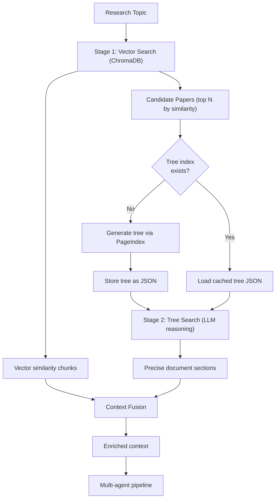

# Hybrid Retrieval: PageIndex + ChromaDB Vector Search

**Overview:** Integrate PageIndex tree-based reasoning retrieval alongside existing ChromaDB vector search to create a hybrid two-stage retrieval pipeline. Self-hosted by default with a feature flag to switch to PageIndex Cloud API.

---

## Implementation Todos

- [ ] **add-deps** — Add pageindex and tiktoken dependencies to pyproject.toml and run uv sync
- [ ] **pdf-cache** — Update arxiv_tool.py to retain PDFs in pdf_cache/ directory with cleanup and add pdf_path to paper dict
- [ ] **tree-index-module** — Create tree_index.py with tree generation (self_hosted + cloud modes), caching, tree search, and section extraction
- [ ] **refactor-rag** — Refactor rag.py to expose vector_search_papers() returning structured results with paper rankings
- [ ] **hybrid-retrieval** — Create hybrid_retrieval.py orchestrating vector search + tree search + context fusion
- [ ] **api-integration** — Update api.py run_dynamic_research_job to use hybrid retrieval when PAGEINDEX_ENABLED=true, with progress updates
- [ ] **env-config** — Update .env.example with PageIndex configuration variables
- [ ] **version-changelog** — Bump version to 0.5.0 in pyproject.toml and update CHANGELOG.md

---

## Current Architecture

The retrieval pipeline in `src/ai_research_backend/rag.py` uses a single-stage approach:

1. ChromaDB vector similarity search (1500-char chunks, `all-MiniLM-L6-v2` embeddings)
2. Top-25 chunks returned if distance <= 1.2
3. If fewer than 15 relevant chunks, download new papers from ArXiv

**Problem:** Vector similarity search finds semantically *similar* text, not necessarily *relevant* text. For complex research topics requiring multi-step reasoning, this leads to missed context and irrelevant chunk retrieval.

## Proposed Architecture: Two-Stage Hybrid Retrieval



- **Stage 1 (fast, broad):** ChromaDB vector search identifies candidate papers and provides broad similarity-matched chunks — unchanged from current behavior.
- **Stage 2 (deep, precise):** PageIndex generates a hierarchical tree structure for the top candidate papers, then uses LLM reasoning to navigate the tree and extract precisely relevant sections — new layer.
- **Context Fusion:** Merge vector chunks (broad coverage) with tree-retrieved sections (precise relevance), deduplicate, and format into enriched context for the multi-agent pipeline.

## Key Design Decisions

- **Self-hosted first:** Use the open-source `pageindex` package directly. Tree generation calls the existing Ollama Cloud endpoint (`gpt-oss:120b-cloud`) via its OpenAI-compatible API.
- **Cloud API switchable:** Feature flag (`PAGEINDEX_MODE`) to switch to PageIndex Cloud API later without code changes.
- **Lazy tree generation:** Trees are generated on first access per paper, then cached as JSON. Subsequent queries reuse cached trees.
- **Selective deep retrieval:** Only the top 3 most relevant papers (by vector similarity) go through tree indexing — avoids excessive LLM calls.
- **PDF retention:** PDFs are kept in a cache directory until tree generation completes (currently deleted immediately after text extraction in `arxiv_tool.py`).

## File Changes

### New Files

**1. `src/ai_research_backend/tree_index.py`** — Core PageIndex integration module

- `generate_tree(pdf_path, arxiv_id, config)` — Calls PageIndex to build tree structure from PDF
- `load_tree(arxiv_id)` / `save_tree(arxiv_id, tree)` — Cache management for `tree_indexes/{arxiv_id}.json`
- `tree_search(tree, query, llm)` — LLM-based reasoning over tree structure to find relevant sections
- `extract_sections_from_tree(tree, node_ids, pdf_path)` — Extract actual text content for matched tree nodes
- Supports two modes: `self_hosted` (open-source pageindex + local LLM) and `cloud` (PageIndex Cloud SDK)

Tree search implementation will prompt the LLM with the tree structure and query, asking it to reason about which branches are relevant (like a human scanning a table of contents), then retrieve the text from those page ranges.

**2. `src/ai_research_backend/hybrid_retrieval.py`** — Orchestrates the two-stage pipeline

- `hybrid_retrieve(papers, topic, top_k_tree_papers=3)` — Main entry point replacing `retrieve_relevant_chunks`
- `_vector_retrieve(papers, topic)` — Wraps existing ChromaDB logic from `rag.py`
- `_tree_retrieve(papers, topic)` — Generates/loads trees for top papers, runs tree search
- `_fuse_contexts(vector_context, tree_context)` — Merges and deduplicates results
- Returns enriched context string with clear source attribution (`[vector-search]` vs `[tree-search]`)

### Modified Files

**3. `pyproject.toml`** — Add dependencies

```
"pageindex>=0.1.0",    # Tree index generation (open-source)
"tiktoken>=0.5.0",     # Token counting for PageIndex
```

The `pageindex` package will be installed from PyPI. If unavailable there, install from GitHub: `"pageindex @ git+https://github.com/VectifyAI/PageIndex.git"`.

**4. `.env.example`** — Add configuration variables

```
# PageIndex Configuration
PAGEINDEX_ENABLED=true
PAGEINDEX_MODE=self_hosted          # self_hosted or cloud
PAGEINDEX_API_KEY=                  # Required only for cloud mode
PAGEINDEX_MODEL=                    # Model for tree generation (defaults to OLLAMA_MODEL)
PAGEINDEX_MAX_TREE_PAPERS=3         # Max papers to tree-index per request
```

**5. `src/ai_research_backend/rag.py`** — Minor refactoring

- Extract `vector_search_papers(topic, top_k)` that returns structured results (papers + scores) instead of just formatted text — needed by hybrid retrieval to rank papers for tree indexing.
- Keep existing functions intact for backward compatibility when PageIndex is disabled.

**6. `src/ai_research_backend/api.py`** — Update research pipeline

In `run_dynamic_research_job()` (line 769):

- When `PAGEINDEX_ENABLED=true`: replace `retrieve_relevant_chunks()` call with `hybrid_retrieve()`
- When `PAGEINDEX_ENABLED=false`: existing behavior unchanged
- Add progress updates for tree generation step ("Generating document tree indexes", ~50%)
- Add progress updates for tree search step ("Deep reasoning-based retrieval", ~55%)

**7. `src/ai_research_backend/tools/arxiv_tool.py`** — PDF retention

- Instead of deleting PDFs after text extraction (line 106-107), move them to a `pdf_cache/` directory
- Add `pdf_path` to the returned paper dict so tree_index can access it
- Add a cleanup mechanism (delete PDFs older than 24 hours)

### New Directory Structure

```
tree_indexes/           # Cached PageIndex tree JSON files
  {arxiv_id}.json       # One tree per paper
pdf_cache/              # Temporary PDF storage for tree generation
  {arxiv_id}.pdf        # Deleted after 24 hours
```

## Retrieval Flow (Hybrid Mode)

1. **Check knowledge base** (existing): `search_existing_knowledge(topic)` via ChromaDB
2. **If insufficient:** Download papers from ArXiv (existing)
3. **Vector retrieval:** Chunk + embed papers in ChromaDB, query top-25 chunks (existing)
4. **Rank papers:** Use vector search distances to identify the top 3 most relevant papers
5. **Tree generation** (new): For each top paper, check `tree_indexes/{arxiv_id}.json`
   - If cached: load tree
   - If not: call PageIndex with PDF from `pdf_cache/`, save tree JSON
6. **Tree search** (new): For each tree, prompt LLM with tree structure + query
   - LLM reasons about which sections are relevant
   - Extract text from those page ranges using PyMuPDF
7. **Context fusion** (new): Merge vector chunks + tree sections
   - Tree sections get priority (higher relevance confidence)
   - Deduplicate overlapping content
   - Format with source attribution
8. **Multi-agent pipeline** (unchanged): Pass enriched context to Paper Analyzer -> Synthesis + Diagram agents

## PageIndex LLM Configuration

Reuse Ollama Cloud for tree generation:

```python
# In tree_index.py
from openai import OpenAI

client = OpenAI(
    api_key=os.getenv("OLLAMA_API_KEY"),
    base_url=os.getenv("OLLAMA_API_BASE", "https://ollama.com/v1"),
)
model = os.getenv("PAGEINDEX_MODEL") or os.getenv("OLLAMA_MODEL", "gpt-oss:120b-cloud")
```

This reuses the existing Ollama Cloud credentials. If the model lacks sufficient reasoning capability for tree generation, set `PAGEINDEX_MODEL` to a different model or switch to `PAGEINDEX_MODE=cloud`.

## Feature Flag Behavior

| `PAGEINDEX_ENABLED` | `PAGEINDEX_MODE` | Behavior |
| ------------------- | ---------------- | -------- |
| `false`             | (ignored)        | Current behavior, vector-only retrieval |
| `true`              | `self_hosted`    | Hybrid: ChromaDB + local PageIndex tree generation via Ollama |
| `true`              | `cloud`          | Hybrid: ChromaDB + PageIndex Cloud API (requires `PAGEINDEX_API_KEY`) |

## Version and Changelog

Bump version to `0.5.0` (new feature: hybrid retrieval). Update `CHANGELOG.md` with:

- **Major change:** Hybrid retrieval pipeline combining vector search with PageIndex reasoning-based tree retrieval
- **Minor change:** PDF caching for tree index generation, new environment variables for PageIndex configuration
